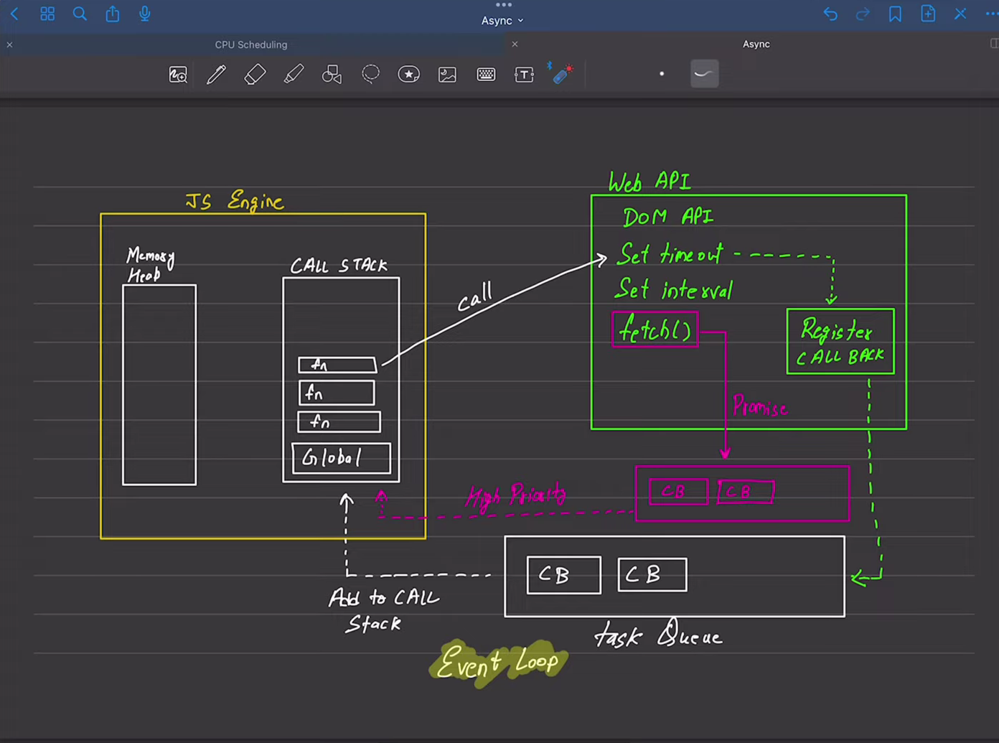

- Async Images
 
- In JavaScript, the async keyword is used to define asynchronous functions. An asynchronous function is a function that operates asynchronously via the event loop, using the ```await```  keyword to pause execution until a ```Promise```  is settled. 
- The use of async and await simplifies working with asynchronous code and promises.
- The async keyword in JavaScript, when used in the context of function declarations, serves the purpose of indicating that the function will operate asynchronously and will always return a Promise. 